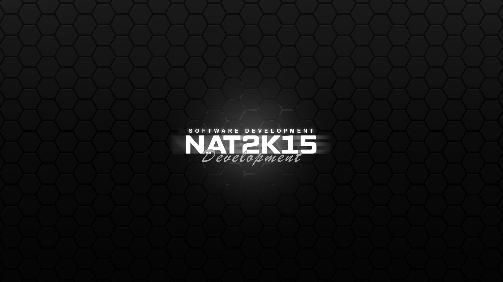

# NAT2K15 Documentation

<figure><figcaption></figcaption></figure>

***

## About Us

Welcome to NAT2K15 Development, a dedicated hub for delivering top-notch scripts and tools tailored for the FiveM community. As one of the emerging names in the field, we pride ourselves on providing high-quality products that enhance the gaming experience for our community members.

Founded nearly three years ago, NAT2K15 Development began by creating Discord bots to serve our community, and more recently, we expanded into developing scripts specifically for FiveM. Our commitment is to offer a customized, seamless experience with every product we release. Whether you're looking for the best FiveM scripts or innovative Discord bots, NAT2K15 Development is here to meet your needs.

If you have any questions or concerns, please don't hesitate to open a ticket. We’re here to ensure you have the best possible experience with our products.

***

## Term of service&#x20;



***

## Support

### Who is eligible for support?

* Every NAT2K15 Development customer
* Every **confirmed** developer of a customer
  * _This means the product owner needs to confirm the developer as their own_

_\*We reserve the right to <mark style="color:red;">**DENY**</mark> support to any customer or non-customer who fails to adhere to our terms of service or does not treat our staff with respect. Please be mindful that our team is busy, and response times may vary. Typically, we aim to respond within 1-5 hours in the Discord server._
