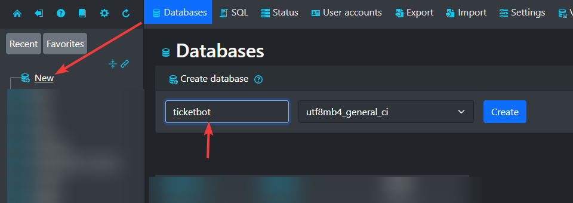

# 🛢️MySQL Installation (xampp)

### _Installing XAMPP:_ 

**Step 1: Download and Install XAMPP**

1. **Visit the Official XAMPP Website**: Go to [Apache Friends](https://www.apachefriends.org/download.html) and download the XAMPP installer for Windows.
2. **Run the Installer**: Launch the downloaded installer. You might need to approve the UAC prompt and disable any antivirus temporarily if it blocks the installation.
3. **Select Components**: During installation, ensure that **Apache**, **MySQL**, and **PHP** are selected. You can deselect other components unless you know you'll need them.
4. **Choose Installation Directory**: You can install XAMPP in the default directory (`C:\xampp`) or choose another location. Click Next and proceed with the installation.
5. **Complete Installation**: Follow the remaining prompts and finish the installation.

**Step 2: Start Apache and MySQL**

1. **Launch XAMPP Control Panel in Administrator**: After installation, open the XAMPP Control Panel. You can find it in the Start Menu or where you installed XAMPP.
2. **Installing services:** When XAMPP opens up click the ❌ button on the left side of Apache and MySQL and install the services.

<figure><figcaption></figcaption></figure>

1. **Start Apache and MySQL**: Click the 'Start' buttons next to Apache and MySQL. This will run your local server and database server.

**Step 3: Creating The Database**

1. **Open phpMyAdmin: Open phpMyAdmin using the `Admin` Button on Apache.**
2. **Creating a database:** Upon opening phpMyAdmin click new on the top left then type for database name `ticketbot` (all lowercase) then click create.

Congratulations, you now know how to create a bot database. Move on to the next page to continue the installation.

<figure><figcaption></figcaption></figure>
