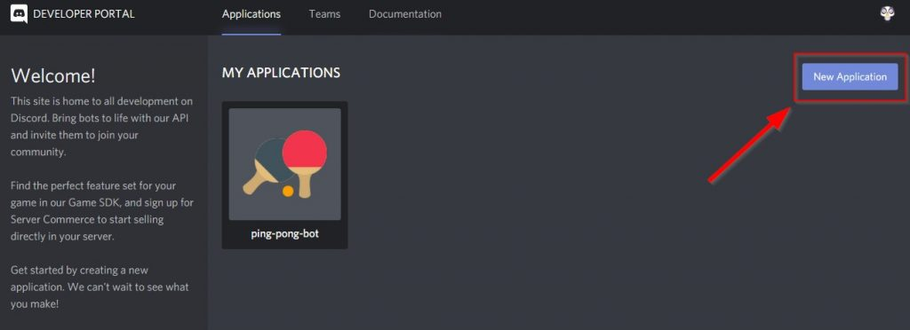

# Discord Bot Token

#### 1. Access the Discord Developer Portal

Start by visiting the [Discord Developer Portal](https://discord.dev/developers/applications/). This portal is where you manage all your applications and bots.

* If you already have a bot, simply select it from the list.
* If not, click the “New Application” button to create one.

<figure><figcaption></figcaption></figure>

#### 2. Name Your Bot

Next, you’ll need to name your bot.

<figure><figcaption></figcaption></figure>

#### 3. Configure Bot Settings

After naming your bot, navigate to the **Bot** tab.

* Click on **Add Bot** if your bot isn't already created.
* Once the bot is created, enable all necessary intents by toggling the options in the **Privileged Gateway Intents** section.

<figure><figcaption></figcaption></figure>

#### 4. Invite the Bot to Your Discord Server

To invite the bot to your Discord server:

1. Go to the **OAuth2** tab.
2. Under **OAuth2 URL Generator**, select the following scopes:
   * `bot`
   * `applications.commands`
3. Scroll down to **OAuth2 URL Generator** and copy the generated URL.
4. Paste this URL into your browser, select your server, and authorize the bot.

<figure><figcaption></figcaption></figure>

#### 5. Retrieve and Configure Your Bot Token

Finally, you’ll need to obtain your bot's token:

1. Navigate to the **Bot** tab.
2. Click **Reset Token** to generate a new token.
3. Copy the token and paste it into your `config.json` file where it says `"token"`.

<figure><figcaption></figcaption></figure>

<figure><figcaption></figcaption></figure>

&#x20;                                                   You have successfully completed the bot setup.
